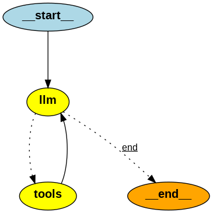

# LocalAgent

A modular, CLI-based AI email assistant that connects to your IMAP inbox, lists unread emails, and summarizes email content using a local LLM via Ollama.

## Features
- **Connects to any IMAP-compatible email inbox** (Gmail, Outlook, etc.)
- **Lists all unread emails** with UID, subject, date, and sender
- **Summarizes any email** by UID using a local LLM
- **Conversational CLI interface** powered by LangChain and LangGraph
- **Extensible modular codebase** for easy feature addition

## Requirements
- **Python 3.12+**
- **[Ollama](https://ollama.com/)** (for running local LLMs)
- **IMAP email account** (credentials required)
- **uv** (for fast Python package management and running)

## Installation

1. **Clone the repository:**
   ```bash
   git clone <your-repo-url>
   cd LocalAgent
   ```

2. **Install [uv](https://github.com/astral-sh/uv):**
   ```bash
   pip install uv
   ```

3. **Install dependencies:**
   ```bash
   uv pip install -r pyproject.toml
   ```

4. **Install and run Ollama:**
   - Download and install Ollama from [https://ollama.com/download](https://ollama.com/download)
   - Start Ollama:
     ```bash
     ollama serve
     ```
   - Pull the required model (e.g., Qwen3 8B):
     ```bash
     ollama pull qwen3:8b
     ```

5. **Configure your environment:**
   - Copy `.env.example` to `.env` (or create `.env`):
     ```env
     IMAP_HOST='imap.example.com'
     IMAP_USER='your_username'
     IMAP_PASSWORD='your_password'
     ```

## Usage

Run the CLI agent:
```bash
uv run main.py
```

You will see:
```
Type instruction or "quit".
>
```

### Example Commands
- `check mail` — Lists all unread emails
- `summarize email <UID>` — Summarizes the email with the given UID
- `quit` — Exits the program

## How It Works
- Uses **Ollama** to run a local LLM (default: Qwen3 8B)
- Uses **LangChain** and **LangGraph** for agent logic and tool orchestration
- Connects to your email via **IMAP** and fetches/summarizes emails

## Agent Graph



The diagram above shows the flow of the LangGraph agent:
- The process starts at the `llm` node, where the language model interprets user input.
- If the LLM determines a tool is needed (like listing or summarizing emails), it routes to the `tools` node.
- The `tools` node executes the appropriate tool and returns the result to the LLM for further processing or response.
- The flow continues until the agent determines the conversation is complete, at which point it ends.

This modular design makes it easy to add new tools or logic to the agent.

## Troubleshooting
- If you see IMAP connection errors, check your `.env` values and network/firewall settings.
- If Ollama is not running, start it with `ollama serve`.
- For LLM errors, ensure the model is pulled and running in Ollama.

